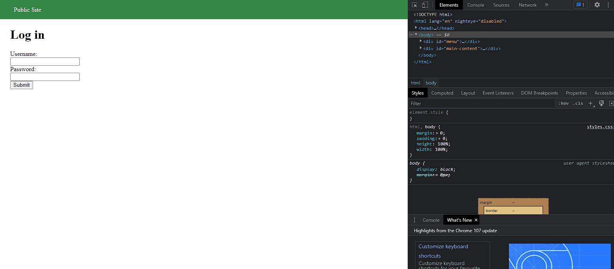
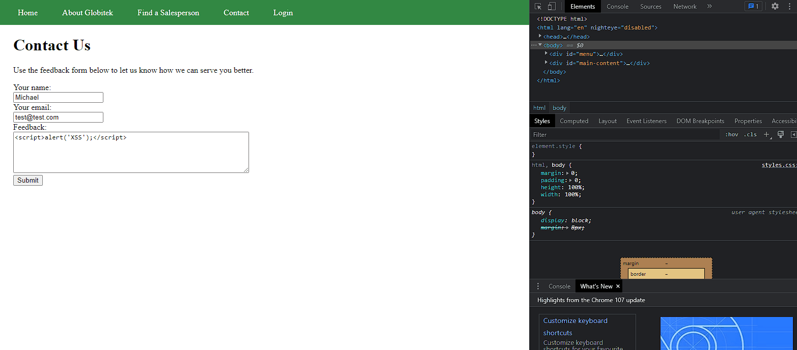
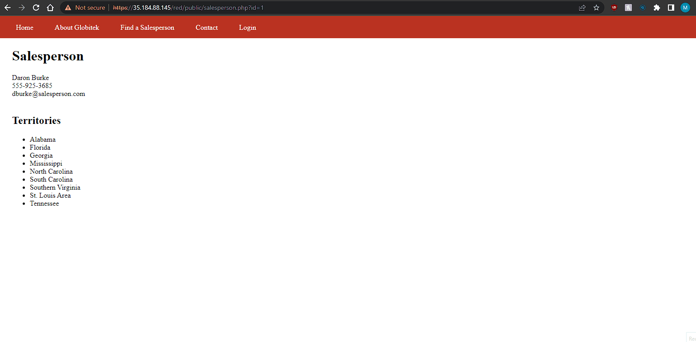

# Pen Testing Live Targets

Time spent: **5** hours spent in total

> Objective: Identify vulnerabilities in three different versions of the Globitek website: blue, green, and red.

The six possible exploits are:

* Username Enumeration
* Insecure Direct Object Reference (IDOR)
* SQL Injection (SQLi)
* Cross-Site Scripting (XSS)
* Cross-Site Request Forgery (CSRF)
* Session Hijacking/Fixation

Each color is vulnerable to only 2 of the 6 possible exploits. First discover which color has the specific vulnerability, then write a short description of how to exploit it, and finally demonstrate it using screenshots compiled into a GIF.

## Blue

Vulnerability #1: __________________

Description:

## Green

Vulnerability #1: Username Enumeration

Description: The developer used different classes when failing to login with a username belonging to an account and one that does not. It is also easy to spot do to one class using bold lettering while one is plaintext. This vulnerability can be exploited to find usernames in the system.

Vulnerability #2: Cross-Site Scripting

Description: The developer has not fully sanitized the code feedback section and it is vulnerable to stores XSS attacks. This can be exploited by adding script in your feedback.

## Red

Vulnerability #1: Insecure Direct Object Reference

Description:In the "Find a Salesperson" page, each salesperson's page is denoted with a numberical ID. Green and Blue have code that prevents users from going to pages not listed, however Red is missing that code and allows users to go to pages with sensitive information not normally available. 

## Notes

Describe any challenges encountered while doing the work
